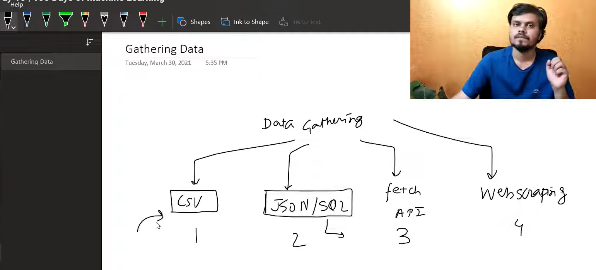

# 📂 Gathering Data

This section contains all notebooks and datasets used throughout the **Gathering Data** module.

---

## 📖 Learning Notebooks

| Notebook | Description |
| :-------- | :---------- |
| [`working-with-csv.ipynb`](documents/working-with-csv.ipynb) | Complete guide to reading and writing CSV files using Pandas. |
| [`class.ipynb`](documents/class.ipynb) | Class demonstrations and instructor examples. |
| [`Practice.ipynb`](documents/Practice.ipynb) | Practice exercises for strengthening CSV handling concepts. |

---

## 📊 Datasets

| Dataset | Purpose |
| :------ | :------ |
| [`aug_train.csv`](documents/aug_train.csv) | Employee attrition dataset for CSV operations. |
| [`BX-Books.csv`](documents/BX-Books.csv) | Book recommendation dataset used for encoding examples. |
| [`IPL Matches 2008-2020.csv`](documents/IPL%20Matches%202008-2020.csv) | IPL historical matches dataset. |
| [`movie_titles_metadata.csv`](documents/movie_titles_metadata.csv) | Movie metadata dataset. |
| [`test.csv`](documents/test.csv) | Sample dataset for demonstrations. |
| [`zomato.csv`](documents/zomato.csv) | Restaurant dataset used for CSV analysis. |

---

## 📝 Notes & Diagrams

| Topic | Preview |
| :---- | :------ |
| Gathering Data |  |

---

## 📁 Repository Structure

```text
Repository
│
├── README.md
├── documents
│   ├── working-with-csv.ipynb
│   ├── class.ipynb
│   ├── Practice.ipynb
│   ├── aug_train.csv
│   ├── BX-Books.csv
│   ├── IPL Matches 2008-2020.csv
│   ├── movie_titles_metadata.csv
│   ├── test.csv
│   └── zomato.csv
│
└── images
    └── data-gathering-01.png
```

---

### 🎯 Learning Objectives

- Read CSV files using **Pandas**
- Export DataFrames to CSV
- Handle delimiters and encodings
- Work with large CSV files using chunking
- Manage missing values and data cleaning
- Practice with real-world datasets

---

> **Note:** All notebooks and datasets are stored inside the **`documents/`** directory, while images used in this README are stored inside the **`images/`** directory.