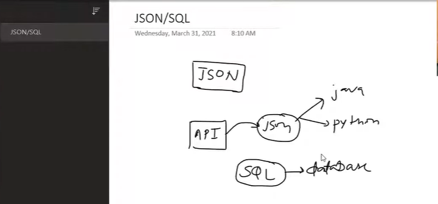

# 📂 Working with JSON

This module introduces **JSON (JavaScript Object Notation)**, one of the most widely used data interchange formats in Data Science, Machine Learning, and Web APIs. It covers the fundamentals of reading, writing, parsing, and manipulating JSON data using Python.

---

## 📖 Learning Notebooks

| Notebook | Description |
| :-------- | :---------- |
| [`class.ipynb`](documents/class.ipynb) | Instructor-led examples demonstrating JSON operations in Python. |
| [`day16.ipynb`](documents/day16.ipynb) | Hands-on exercises covering JSON parsing, serialization, and practical use cases. |

---

## 📊 Datasets & Resources

| File | Description |
| :--- | :---------- |
| [`train.json`](documents/train.json) | Sample JSON dataset used throughout the notebooks for practical demonstrations. |
| [`world.sql`](documents/world.sql) | SQL database containing sample data used alongside JSON examples. |

---

## 📝 Notes & Diagrams

| Topic | Preview |
| :---- | :------ |
| Working with JSON |  |

---

## 📁 Repository Structure

```text
08-Working-With-JSON/
│
├── README.md
├── documents/
│   ├── class.ipynb
│   ├── day16.ipynb
│   ├── readme.md
│   ├── train.json
│   └── world.sql
│
└── images/
    └── work-with-json-01.png
```

---

## 🎯 Learning Outcomes

After completing this module, you will be able to:

- Understand the structure and syntax of JSON
- Read JSON files into Python
- Convert Python objects to JSON format
- Parse JSON strings using the `json` module
- Work with nested JSON objects and arrays
- Serialize and deserialize JSON data
- Handle JSON data from files and APIs
- Integrate JSON with SQL-based workflows

---

## 🛠️ Prerequisites

Before starting this module, you should have:

- Basic knowledge of Python
- Familiarity with dictionaries and lists
- Jupyter Notebook or JupyterLab installed
- Python 3.x environment

---

## 📚 Technologies Used

- Python
- JSON
- Jupyter Notebook
- SQL
- Python `json` Module

---

> **Note:** All notebooks, datasets, and supporting files are located in the **`documents/`** directory, while images used in this README are stored in the **`images/`** directory.