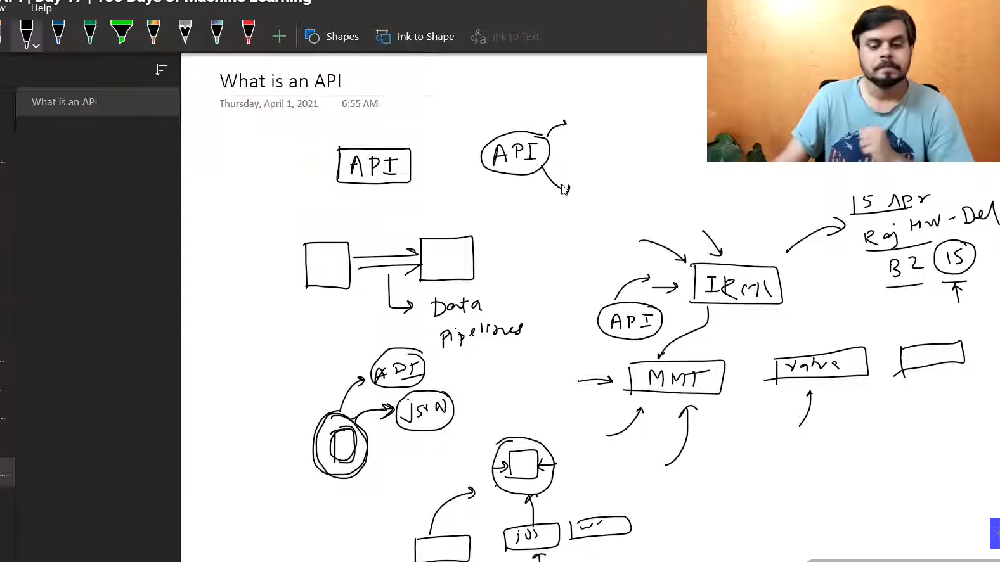

# 📂 Fetching Data from API

This module introduces the fundamentals of **fetching data from REST APIs** using Python. It demonstrates how to send HTTP requests, retrieve JSON responses, parse API data, and convert it into structured datasets for Data Analysis and Machine Learning.

---

## 📖 Learning Notebooks

| Notebook | Description |
| :-------- | :---------- |
| [`class.ipynb`](documents/class.ipynb) | Instructor-led examples covering API requests, JSON responses, and data extraction. |
| [`day17.ipynb`](documents/day17.ipynb) | Hands-on practice for fetching, processing, and storing API data using Python. |

---

## 📊 Dataset

| File | Description |
| :--- | :---------- |
| [`movies.csv`](documents/movies.csv) | Dataset generated by fetching movie information from an online API and converting the JSON response into CSV format. |

---

## 📝 Notes & Diagrams

| Topic | Preview |
| :---- | :------ |
| Fetching Data from API |  |

---

## 📁 Repository Structure

```text
09-Fetching-Data-From-API/
│
├── README.md
├── documents/
│   ├── class.ipynb
│   ├── day17.ipynb
│   └── movies.csv
│
└── images/
    └── fetching-data-01.png
```

---

## 🎯 Learning Outcomes

After completing this module, you will be able to:

- Understand the fundamentals of REST APIs
- Send HTTP requests using the `requests` library
- Handle GET requests and API responses
- Parse JSON data returned by APIs
- Convert JSON responses into Pandas DataFrames
- Fetch data from multiple API pages
- Export API data to CSV format
- Handle common API errors and response status codes

---

## 🛠️ Prerequisites

Before starting this module, you should have:

- Basic knowledge of Python
- Familiarity with functions and loops
- Basic understanding of JSON
- Python 3.x installed
- Jupyter Notebook or JupyterLab

---

## 📚 Technologies Used

- Python
- Requests
- Pandas
- JSON
- REST API
- Jupyter Notebook

---

> **Note:** All notebooks and datasets are stored inside the **`documents/`** directory, while images used in this README are stored inside the **`images/`** directory.