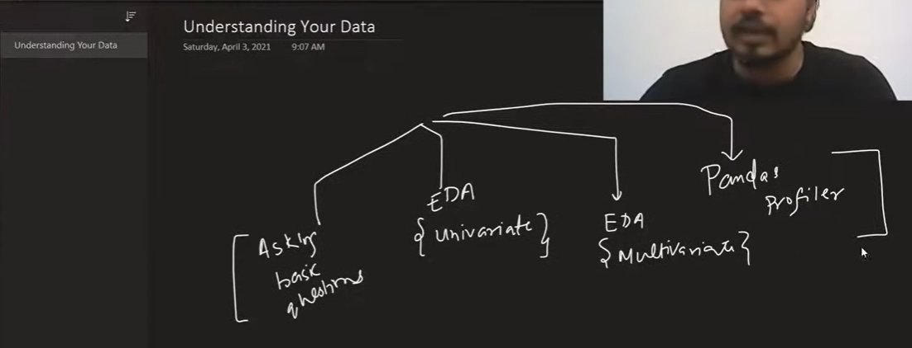

# 📂 Data Understanding

This section contains the notebook and dataset used to explore and understand the data before preprocessing and modeling. Data Understanding is the second phase of the Data Science lifecycle, where we inspect the dataset, identify potential issues, and gather meaningful insights.

---

## 📖 Learning Notebook

| Notebook | Description |
| :-------- | :---------- |
| [`day19.ipynb`](documents/day19.ipynb) | Introduction to Data Understanding using Pandas. Covers dataset exploration, data quality assessment, descriptive statistics, duplicate detection, and correlation analysis. |

---

## 📊 Dataset

| Dataset | Purpose |
| :------ | :------ |
| [`train.csv`](documents/train.csv) | Titanic training dataset used to perform exploratory data inspection and understand dataset characteristics. |

---

## 🔍 Topics Covered

The notebook demonstrates the following essential data understanding tasks using **Pandas**:

| Step | Description |
| :--- | :---------- |
| **Dataset Size** | Check the number of rows and columns using `df.shape`. |
| **Data Preview** | Inspect random records using `df.sample()`. |
| **Data Types** | Analyze column names, data types, and memory usage using `df.info()`. |
| **Missing Values** | Identify missing values in each column using `df.isnull().sum()`. |
| **Descriptive Statistics** | Generate statistical summaries using `df.describe()`. |
| **Duplicate Records** | Detect duplicate rows using `df.duplicated().sum()`. |
| **Correlation Analysis** | Measure relationships between numerical features using `df.corr()`. |

---

## 📝 Notes & Diagrams

| Topic | Preview |
| :---- | :------ |
| Data Understanding Workflow |  |

---

## 📁 Repository Structure

```text
Repository
│
├── README.md
├── documents
│   ├── day19.ipynb
│   └── train.csv
│
└── images
    └── data-understanding-01.png
```

---

## 🎯 Learning Objectives

- Understand the structure and size of a dataset
- Inspect sample records for initial exploration
- Identify numerical and categorical features
- Detect missing values and duplicate records
- Generate descriptive statistics for numerical columns
- Analyze relationships between numerical features using correlation
- Build a strong understanding of the dataset before preprocessing and feature engineering

---

> **Note:** All notebooks and datasets are stored inside the **`documents/`** directory, while images used in this README are stored inside the **`images/`** directory.