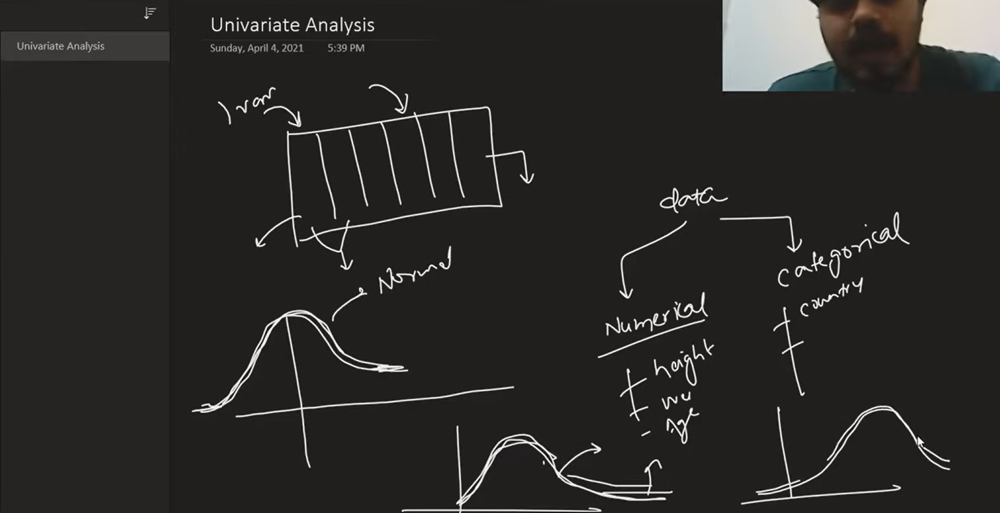

# 📂 Exploratory Data Analysis - Univariate Analysis

This section introduces **Univariate Analysis**, the first step of Exploratory Data Analysis (EDA). The notebook demonstrates how to analyze **individual variables** using descriptive statistics and visualizations to understand their distribution, identify patterns, and detect potential outliers.

---

## 📖 Learning Notebook

| Notebook | Description |
| :-------- | :---------- |
| [`day20.ipynb`](documents/day20.ipynb) | Learn how to perform univariate analysis on categorical and numerical features using Pandas, Matplotlib, and Seaborn. |

---

## 📊 Dataset

| Dataset | Purpose |
| :------ | :------ |
| [`train.csv`](documents/train.csv) | Titanic dataset used to explore the distribution of categorical and numerical variables through various visualization techniques. |

---

## 🔍 Topics Covered

### 📌 Categorical Data Analysis

| Visualization | Description |
| :------------ | :---------- |
| **Count Plot** | Visualize the frequency of each category using `sns.countplot()`. |
| **Pie Chart** | Display the percentage distribution of categorical values using `value_counts().plot(kind='pie')`. |

---

### 📈 Numerical Data Analysis

| Visualization | Description |
| :------------ | :---------- |
| **Histogram** | Understand the frequency distribution of numerical features using `plt.hist()`. |
| **Distribution Plot** | Observe the probability distribution and density using `sns.distplot()`. |
| **Box Plot** | Detect outliers and understand the spread of data using `sns.boxplot()`. |

---

### 📊 Descriptive Statistics

The notebook also demonstrates how to compute important statistical measures:

| Statistic | Purpose |
| :-------- | :------ |
| **Minimum** | Find the smallest value in a feature. |
| **Maximum** | Find the largest value in a feature. |
| **Mean** | Calculate the average value of a feature. |
| **Skewness** | Measure the asymmetry of the data distribution. |

---

## 📝 Notes & Diagrams

| Topic | Preview |
| :---- | :------ |
| EDA - Univariate Analysis |  |

---

## 📁 Repository Structure

```text
Repository
│
├── README.md
├── documents
│   ├── day20.ipynb
│   └── train.csv
│
└── images
    └── eda-univariate-analysis-01.png
```

---

## 🎯 Learning Objectives

- Understand the fundamentals of Exploratory Data Analysis (EDA)
- Perform univariate analysis on categorical features
- Visualize categorical distributions using Count Plot and Pie Chart
- Analyze numerical features using Histogram, Distribution Plot, and Box Plot
- Detect outliers and understand data spread
- Calculate basic descriptive statistics
- Measure data skewness and interpret distribution shape
- Build intuition about data before moving to bivariate and multivariate analysis

---

> **Note:** All notebooks and datasets are stored inside the **`documents/`** directory, while images used in this README are stored inside the **`images/`** directory.