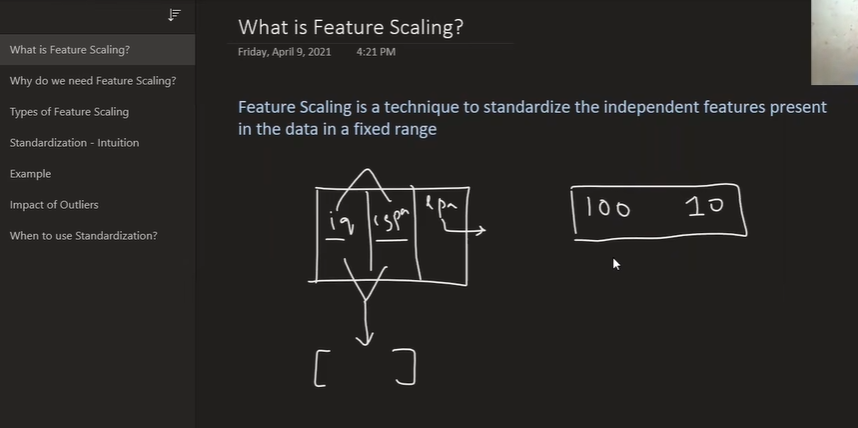
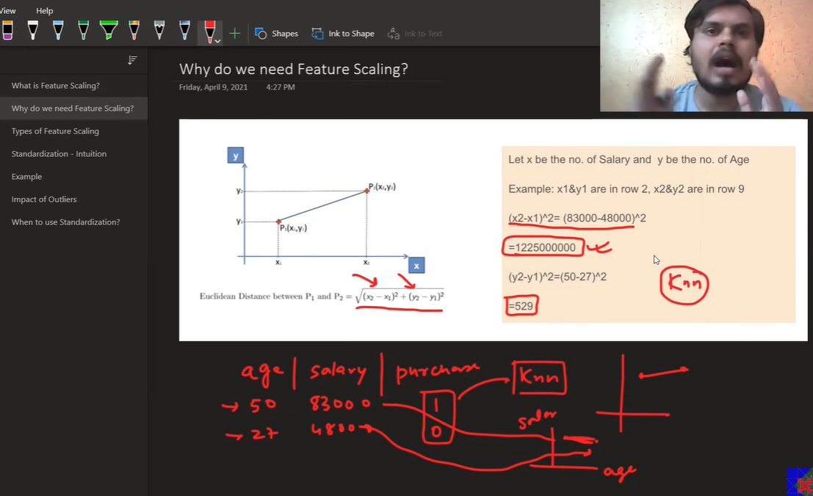
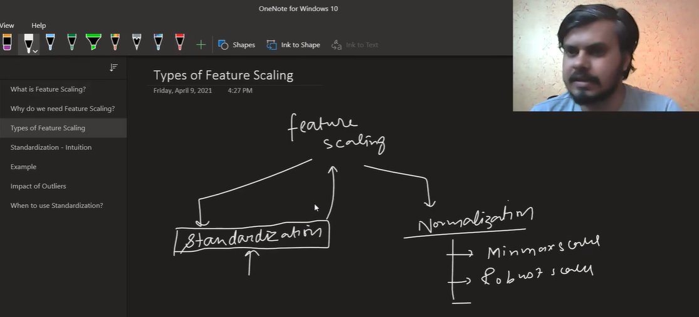
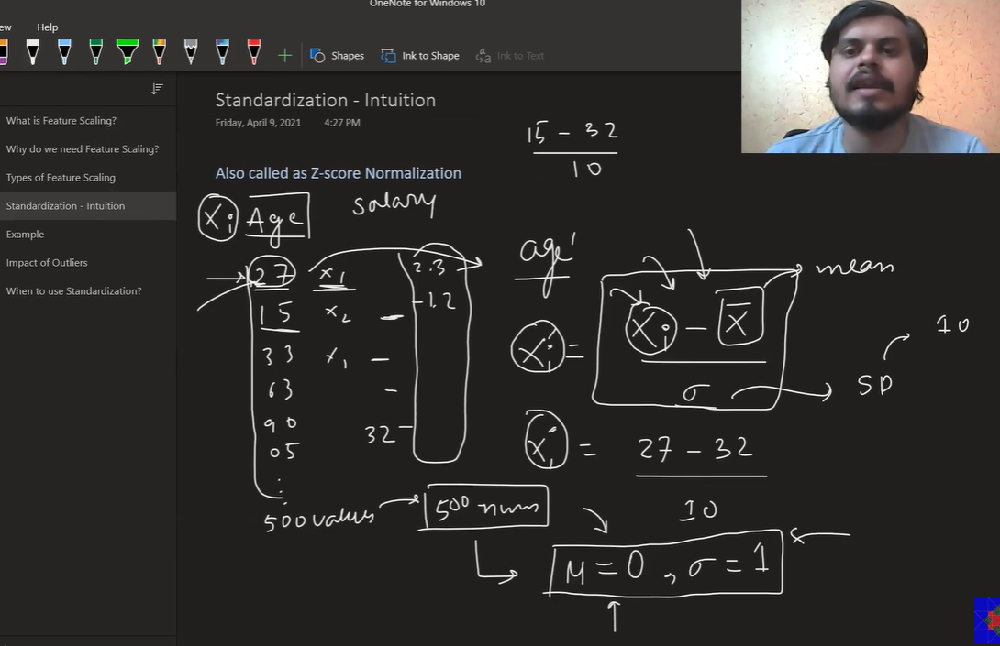
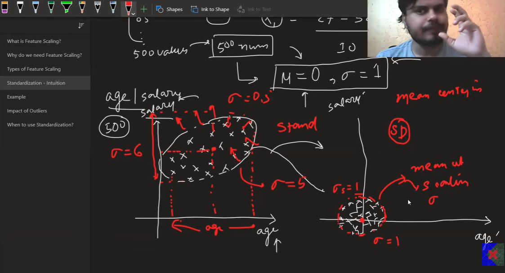
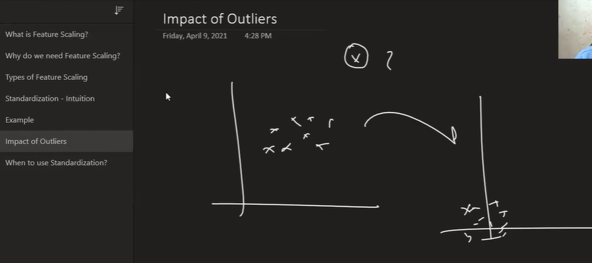
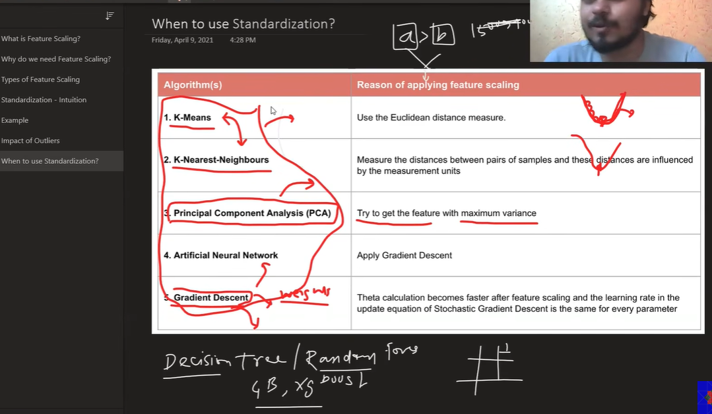

# 📂 Feature Scaling & Standardization

This section contains the notebooks and dataset used to explore and implement Feature Scaling techniques, focusing on Standardization (Z-score Normalization). Feature scaling is a core preprocessing step that transforms independent features into comparable numerical ranges, ensuring algorithms treating distance or gradients perform accurately without bias toward high-magnitude values.

---

## 📖 Learning Notebooks

| Notebook | Description |
| :-------- | :---------- |
| [`day24.ipynb`](documents/day24.ipynb) | Hands-on execution of Feature Scaling using Scikit-Learn's `StandardScaler`. Demonstrates Z-score transformation, algorithm performance before/after scaling, and visualization of transformed distributions. |
| [`class.ipynb`](documents/class.ipynb) | Class practice notebook containing manual Z-score calculations, feature comparison experiments, and interactive code implementations. |

---

## 📊 Dataset

| Dataset | Purpose |
| :------ | :------ |
| [`Social_Network_Ads.csv`](documents/Social_Network_Ads.csv) | Classification dataset containing `Age` (20–60 range) and `EstimatedSalary` (15,000–150,000 range) to demonstrate how feature scale disparity impacts distance calculations and model convergence. |

---

## 🔍 Topics Covered

The slides and notebooks cover the following core concepts of feature scaling:

| Topic | Description |
| :--- | :---------- |
| **What is Feature Scaling?** | Technique to standardize independent features into a fixed, comparable scale. |
| **Why Scale Features?** | Prevents high-magnitude features such as Salary = 83,000 from overwhelming small-magnitude features such as Age = 50 in distance calculations. |
| **Types of Feature Scaling** | Breakdown of scaling branches: **Standardization** vs. **Normalization** (Min-Max Scaling, Robust Scaling). |
| **Standardization Intuition** | Also called Z-score Normalization: `x' = (x - μ) / σ`. Rescales data to achieve mean μ = 0 and standard deviation σ = 1. |
| **Geometric Interpretation** | Shifts feature distributions so the center of data lies at origin (0,0) with unit variance along feature axes. |
| **Impact of Outliers** | Analysis of how extreme value points affect feature scaling and distribution compression. |
| **Algorithm Requirements** | **Requires Scaling:** K-Means, K-NN, PCA, Artificial Neural Networks, and Gradient Descent. **No Scaling Needed:** Decision Trees, Random Forest, Gradient Boosting, XGBoost. |

---

## 📝 Notes & Diagrams

| Topic | Preview |
| :---- | :------ |
| What is Feature Scaling? |  |
| Why do we need Feature Scaling? |  |
| Types of Feature Scaling |  |
| Standardization Intuition & Formula |  |
| Geometric Interpretation (μ = 0, σ = 1) |  |
| Impact of Outliers |  |
| Algorithm Suitability Guide |  |

---

## 📁 Repository Structure

    16-Feature-Scaling
    │
    ├── documents
    │   ├── class.ipynb
    │   ├── day24.ipynb
    │   └── Social_Network_Ads.csv
    │
    ├── images
    │   ├── feature-scaling-001.png
    │   ├── feature-scaling-002.png
    │   ├── feature-scaling-003.png
    │   ├── feature-scaling-004.png
    │   ├── feature-scaling-005.png
    │   ├── feature-scaling-006.png
    │   └── feature-scaling-007.png
    │
    └── README.md
---

## 🎯 Learning Objectives

- Understand why unscaled features dominate distance calculations in distance-based machine learning algorithms such as **K-NN** and **K-Means**.
- Distinguish between **Standardization** (Z-score scaling) and **Normalization** (Min-Max & Robust Scaling).
- Calculate Z-score transformations manually using `x' = (x - μ) / σ` to obtain centered data with mean μ = 0 and standard deviation σ = 1.
- Identify algorithms sensitive to scaling such as **K-NN, K-Means, PCA, Neural Networks, and SGD** versus scale-invariant tree-based algorithms such as **Decision Trees, Random Forest, and XGBoost**.
- Implement `StandardScaler` using Scikit-Learn while avoiding data leakage during train-test splitting.

---

> **Note:** Feature scaling is especially important for distance-based and gradient-based algorithms because differences in feature magnitude can affect model performance and convergence. Tree-based algorithms generally do not require feature scaling. All notebooks and datasets are stored inside the **`documents/`** directory, while images used in this README are stored inside the **`images/`** directory.